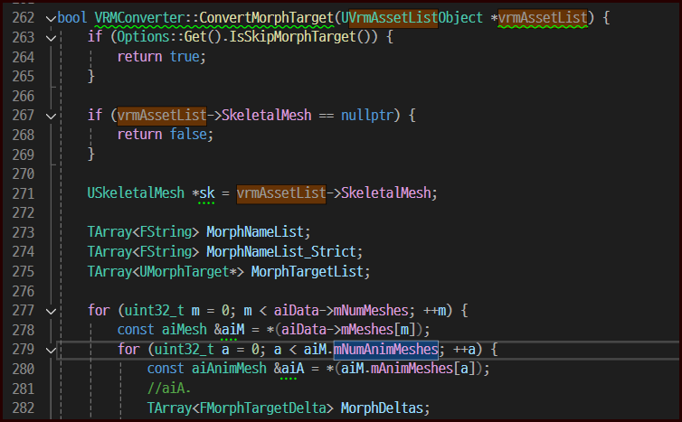
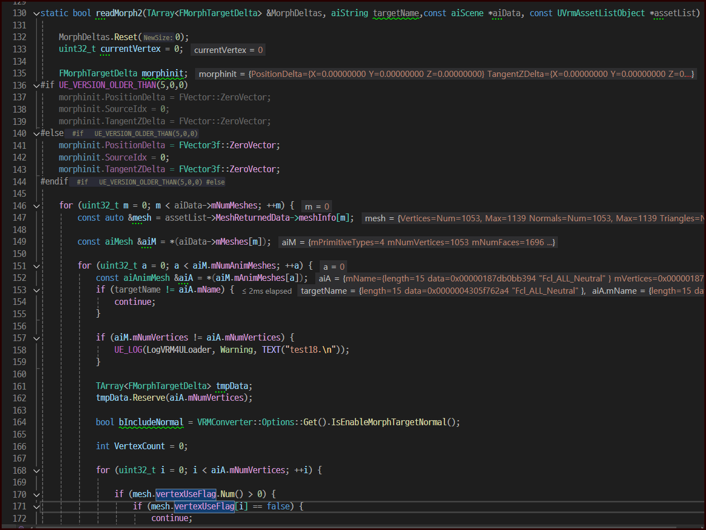
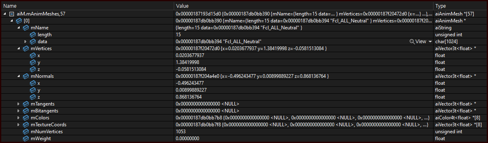
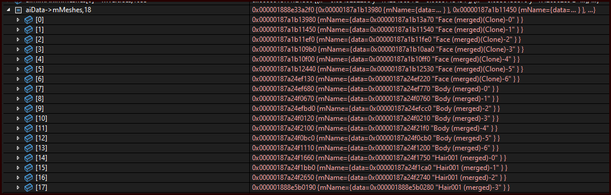

## Morph Target

### Morph Target ?

애니메이션 기술 중 하나

- 다른 명칭

  - Morph target animation,
  - per-vertex animation,
  - shape interpolation,
  - shape keys,
  - blend shapes

- 'deformed' 버전의 메시 정보를 저장, vertex 위치들을 활용함
- 애니메이션 키프레임 설정: deformed <-> base 보간을 통해 애니메이션
  - 간단한 예제: https://rdmilligan.wordpress.com/2018/11/12/opengl-morph-target-animation-with-c/
    - 두 모델의 vertex를 셰이더 안에서 보간을 수행함

출처: https://en.wikipedia.org/wiki/Morph_target_animation

### 관련 데이터 import

사용하고 있는 Import 라이브러리 Assimp [BlendShape 문서제공 x](https://assimp-docs.readthedocs.io/en/latest/usage/use_the_lib.html?highlight=anim#blenshapes)

언리얼 플러그인 VRM4U 분석하면서 진행함

VRM4U 임포트 부분

- vrm scale 조정하는 부분 참고
  - GetExtAndSetModelTypeLocal
  - vrm10 이면 100 을 곱함

| ConvertMorphTarget                  |
| ----------------------------------- |
|  |

1. Scene > Mesh > AnimMesh

- 만약, 이미 처리한 애님 메시라면 스킵 아니라면, `readMorph2` 함수를 통해 데이터를 얻어옴
  - `readMorph2(MorphDeltas, aiA.mName, aiData, vrmAssetList)`

| readMorph2                          |
| ----------------------------------- |
|  |

- `readMorph2`
  - 이 함수는 애님메시의 이름을 받고, 이에 해당하는 애님 메쉬 모두를 처리한다
    - 모델 > 메시 여러개 존재 > 애님 메시는 여러 메시에 영향을 줄 수 있기 때문
  - 모든 메시를 순회 > 현재 조사 중인 애니메시가 있는지 확인

| animMesh                            | mesh                                |
| ----------------------------------- | ----------------------------------- |
|  |  |

- animmesh 에는 vertex, normal 이 존재, 이것은 mesh의 변형

###

https://antongerdelan.net/opengl/blend_shapes.html
https://www.geeks3d.com/20140205/glsl-simple-morph-target-animation-opengl-glslhacker-demo/

https://github.com/pixelsnafu/Cry_Project/blob/master/shader.vert

https://github.com/KhronosGroup/glTF-Tutorials/blob/main/gltfTutorial/gltfTutorial_017_SimpleMorphTarget.md

https://www.youtube.com/watch?v=5znbtXgLj78
